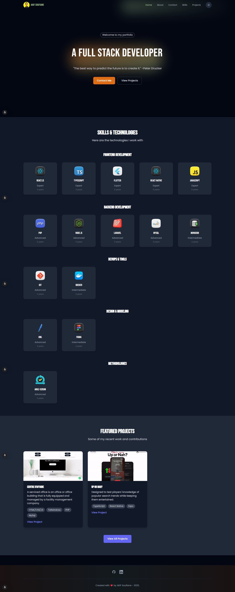

# Modern Portfolio Website

A modern, responsive portfolio website built with Next.js 15, TypeScript, and Tailwind CSS. Features smooth animations, dark mode support, multilingual content (English/French), and a clean, professional design.



## 🌟 Features

- **Modern Tech Stack**: Built with Next.js 15
- **Type-Safe**: Written in TypeScript for better development experience
- **Responsive Design**: Looks great on all devices (mobile, tablet, desktop)
- **Dark Mode**: Automatic and manual dark mode support
- **Multilingual**: Full English and French language support with flag indicators
- **Interactive Skills**: Visual skill level indicators with progress bars
- **Smooth Animations**: Page transitions and scroll animations using Framer Motion
- **Contact Form**: Integrated with reCAPTCHA for spam protection
- **Performance Optimized**: Fast loading times with optimized images and assets
- **SEO Friendly**: Built with SEO best practices in mind

## 🏗️ Architecture

```
portfolio/
├── src/
│   ├── app/                 # Next.js app directory
│   │   ├── about/          # About page
│   │   ├── contact/        # Contact page
│   │   ├── projects/       # Projects page
│   │   ├── skills/         # Skills page
│   │   └── page.tsx        # Home page
│   ├── components/         # Reusable components
│   │   ├── Header.tsx      # Navigation header
│   │   ├── Footer.tsx      # Footer component
│   │   ├── HeroSection.tsx # Hero section
│   │   └── ...            # Other components
│   ├── context/           # React context providers
│   │   ├── ThemeProvider.tsx    # Dark mode context
│   │   └── LanguageContext.jsx  # Language context
│   ├── data/              # Static data and content
│   └── styles/            # Global styles
├── public/                # Static files
│   ├── images/           # Image assets
│   │   └── flags/        # Language flag icons
│   └── locales/          # Translation files
└── package.json          # Project dependencies
```

## 🛠️ Tech Stack

### Core
- **Next.js** (v15.1.6) - React framework for production
- **React** (v19.0.0) - UI library
- **TypeScript** (v5) - Type safety
- **Tailwind CSS** (v3.4.1) - Utility-first CSS

### UI/UX
- **Framer Motion** (v12.4.1) - Animations
- **React Type Animation** (v3.2.0) - Text animations

### Development
- **ESLint** (v9) - Code linting
- **PostCSS** (v8) - CSS processing
- **TypeScript** (v5) - Type checking

## 🚀 Getting Started

1. **Clone the repository**
   ```bash
   git clone https://github.com/Soufianeakif/my-portfolio.git
   cd my-portfolio
   ```

2. **Install dependencies**
   ```bash
   npm install
   # or
   yarn install
   ```

3. **Set up environment variables**
   Create a `.env` file in the root directory:
   ```env
   NEXT_PUBLIC_RECAPTCHA_SITE_KEY=your_recaptcha_site_key
   NEXT_PUBLIC_WEB3FORMS_KEY=your_web3forms_key
   ```

4. **Run the development server**
   ```bash
   npm run dev
   # or
   yarn dev
   ```

5. **Open [http://localhost:3000](http://localhost:3000)**

## 🔧 Configuration

- **Content**: Edit `src/data/content.json` to update site content
- **Styling**: Modify `tailwind.config.js` for theme customization
- **Components**: Add/edit components in `src/components`
- **Languages**: Update translations in `src/data/content.json`

## 📱 Responsive Design

- Mobile-first approach
- Breakpoints:
  - Mobile: < 640px
  - Tablet: 640px - 1024px
  - Desktop: > 1024px

## 🎨 Color Scheme

- Primary: #DF6D14 (Orange)
- Secondary: #9DC08B (Green)
- Dark Mode Colors:
  - Background: #111827
  - Text: #F9FAFB

## 🌐 Language Support

- English (Default)
- French
- Easy to add more languages
- Language switcher with flag icons
- Persistent language selection

## 📦 Build & Deploy

1. **Build for production**
   ```bash
   npm run build
   # or
   yarn build
   ```

2. **Start production server**
   ```bash
   npm start
   # or
   yarn start
   ```

## 🤝 Contributing

Contributions are welcome! Please feel free to submit a Pull Request.

## 📄 License

This project is licensed under the MIT License - see the [LICENSE](LICENSE) file for details.

## 👤 Author

- **AKIF Soufiane**
- GitHub: [@Soufianeakif](https://github.com/Soufianeakif)
- LinkedIn: [soufiane-akif](https://linkedin.com/in/soufiane-akif)
